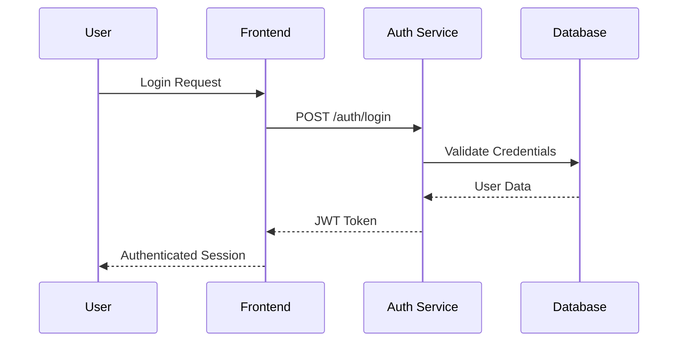
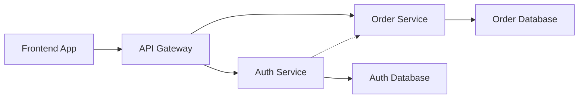
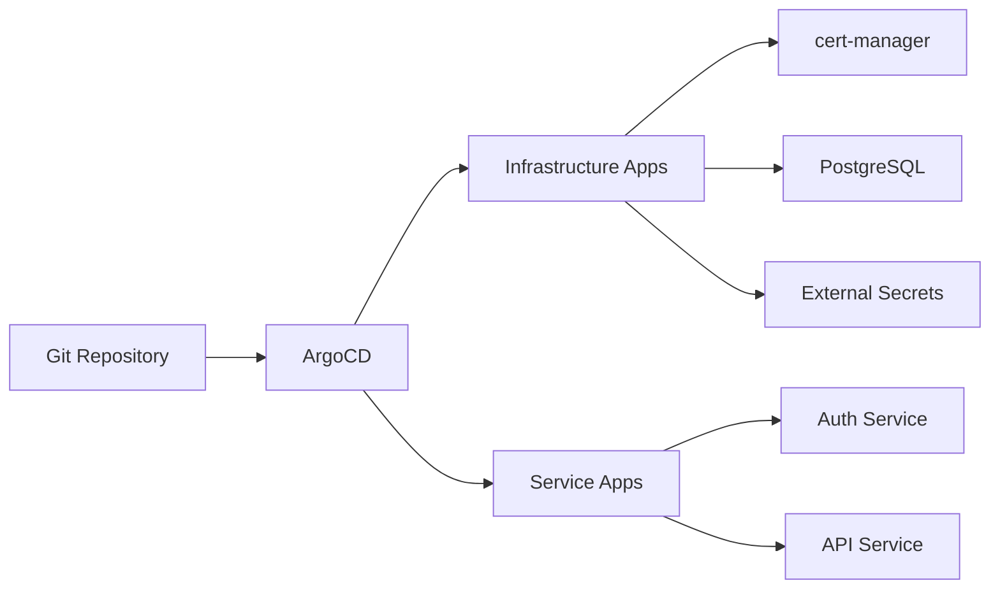

# Architecture Overview

This monorepo implements a microservices architecture built with modern TypeScript technologies, optimized for scalability and developer experience.

## 🏗 System Architecture

### Microservices Design

The system is organized around loosely coupled services that communicate through well-defined APIs:

```
┌─────────────────┐    ┌─────────────────┐    ┌─────────────────┐
│   Frontend Apps │    │  Backend APIs   │    │   Databases     │
│                 │    │                 │    │                 │
│ • React 19      │◄──►│ • Hono          │◄──►│ • PostgreSQL    │
│ • TanStack      │    │ • Better Auth   │    │ • Drizzle ORM   │
│ • Tailwind CSS  │    │ • Service Disc. │    │ • Type Safety   │
└─────────────────┘    └─────────────────┘    └─────────────────┘
```

### Service Discovery

All services are registered and discovered through the `@repo/service-discovery` package:

- **Centralized configuration** for service URLs
- **Environment-aware** routing (dev/prod)
- **Type-safe** service communication
- **CORS management** across services

## 📁 Project Structure

```
monorepo-template/
├── apps/                     # Application services
│   ├── backend/             # Backend microservices
│   │   ├── auth/           # Authentication service
│   │   └── order/          # Order management service
│   └── frontend/           # Frontend applications
├── orms/              # Database configurations
│   └── db-auth/           # Authentication database
├── packages/              # Shared packages
│   ├── auth/             # Authentication utilities
│   ├── service-discovery/ # Service registry
│   └── ui/               # Shared UI components
└── tooling/              # Development tooling
    ├── eslint/           # Linting configurations
    ├── prettier/         # Code formatting
    ├── tailwind/         # Styling configurations
    ├── typescript/       # TypeScript configs
    └── vitest/           # Testing framework
```

### Service Categories

#### Backend Services (`apps/backend/`)

Microservices built with Hono framework:

- **auth**: Authentication and authorization using Better Auth
- **order**: Order management and processing
- Each service is independently deployable
- Shared patterns and configurations

#### Frontend Applications (`apps/frontend/`)

React applications using modern stack:

- **React 19** with latest features
- **TanStack Router** for routing
- **Tailwind CSS** for styling
- **Radix UI** for components

#### Shared Packages (`packages/`)

Reusable code across services:

- **@repo/auth**: Authentication utilities and types
- **@repo/ui**: React component library
- **@repo/service-discovery**: Service registry and communication

#### Database Packages (`orms/`)

Isolated database configurations:

- **db-auth**: Authentication database schema
- **Drizzle ORM** for type-safe database access
- **Migration management** with Drizzle Kit

## 🔄 Service Communication

### CORS Configuration

Centralized CORS management for cross-service communication:

```typescript
// Service discovery handles CORS
const corsOrigins = getTrustedOrigins();
app.use(cors({ origin: corsOrigins }));
```

## 📊 Data Flow

### Authentication Flow



### Service-to-Service Communication



## 🛠 Development Patterns

### Shared Configuration

All services inherit from shared configurations:

```typescript
// packages/service-discovery/src/config.ts
export const serviceConfig = {
  development: {
    auth: "http://localhost:3001",
    order: "http://localhost:3002",
  },
  production: {
    auth: process.env.AUTH_SERVICE_URL,
    order: process.env.ORDER_SERVICE_URL,
  },
};
```

### Type Safety

Strong typing across service boundaries:

```typescript
// Used in both frontend and backend
import type { User } from "@repo/auth";

// Shared types in packages/auth/src/types.ts
export interface User {
  id: string;
  email: string;
  role: UserRole;
}
```

### Environment Management

Validated environment variables using `@t3-oss/env-core`:

```typescript
// apps/backend/auth/src/env.ts
export const env = createEnv({
  server: {
    DATABASE_URL: z.string().url(),
    JWT_SECRET: z.string().min(32),
    DISCORD_CLIENT_ID: z.string(),
  },
});
```

## 🚀 Deployment Architecture

### Container Strategy

Each service is containerized with optimized Docker images:

```dockerfile
# Multi-stage build for production
FROM node:22-alpine AS builder
WORKDIR /app
COPY package*.json ./
RUN npm ci --only=production

FROM node:22-alpine AS runtime
WORKDIR /app
COPY --from=builder /app/node_modules ./node_modules
COPY . .
CMD ["node", "dist/index.js"]
```

### Kubernetes Infrastructure

The project uses a comprehensive Kubernetes setup with GitOps deployment:

#### Infrastructure Components

```
argocd/
├── infra/                    # Core infrastructure
│   ├── cert-manager/         # TLS certificate management
│   ├── external-secrets/     # External secret management
│   ├── cnpg-system/         # PostgreSQL operator
│   ├── maildev/             # Development email server
│   ├── minio/               # S3-compatible object storage
│   └── reflector/           # Secret/ConfigMap replication
├── services/                 # Application services
│   ├── auth/                # Authentication service resources
│   ├── api/                 # API service resources
│   └── common/              # Shared database and resources
└── appsets/                 # ArgoCD ApplicationSets
    └── dev/                 # Development environment
        ├── infra.yaml       # Infrastructure applications
        └── services.yaml    # Service applications
```

#### Database Architecture

PostgreSQL is managed by CloudNativePG (CNPG) operator:

- **High availability** with automatic failover
- **Backup and recovery** capabilities
- **TLS encryption** for secure connections
- **Role-based access** with dedicated admin credentials

### Infrastructure as Code

Terraform provides infrastructure across environments:

#### Local Development (`terraform/kind-local/`)

```
kind-local/
├── kind.tf              # KIND cluster configuration
├── cilium.tf            # Cilium CNI networking
├── argocd.tf            # ArgoCD GitOps platform
├── traefik.tf           # Ingress controller
├── gateway.tf           # Gateway API resources
├── registry.tf          # Local container registry
└── tls.tf              # TLS certificate generation
```

#### Production AWS (`terraform/eks/`)

```
eks/
├── aws.tf              # EKS cluster and IAM
├── gateway.tf          # AWS Load Balancer Controller
├── cilium.tf           # Cilium CNI on EKS
├── argocd.tf           # ArgoCD for production
└── providers.tf        # AWS provider configuration
```

#### Reusable Modules (`terraform/module-aws/`)

```
module-aws/
├── eks/                # EKS cluster module
│   ├── cluster.tf      # EKS cluster configuration
│   ├── nodes.tf        # Worker node groups
│   └── iam.tf          # IAM roles and policies
├── network/            # VPC networking module
│   ├── vpc.tf          # VPC and subnets
│   ├── nat.tf          # NAT gateways
│   └── igw.tf          # Internet gateway
└── karpenter/          # Karpenter autoscaler
    ├── karpenter.tf    # Karpenter installation
    └── iam.tf          # Service account roles
```

### GitOps with ArgoCD

ArgoCD provides continuous deployment with:

- **ApplicationSets** for managing multiple applications
- **Automated synchronization** from Git repository
- **Environment-specific** configurations
- **Self-healing** and automatic pruning
- **Wave-based deployment** ordering



### Networking Architecture

#### Local Development

- **KIND cluster** with port forwarding
- **Traefik ingress** for HTTP routing
- **Self-signed certificates** for HTTPS
- **Local registry** for container images

#### Production (AWS)

- **AWS Load Balancer Controller** for ingress
- **Cilium CNI** for pod networking
- **VPC with public/private subnets**
- **NAT gateways** for outbound connectivity

## 🔒 Security Architecture

### Authentication Strategy

- **Better Auth** for user authentication
- **JWT tokens** for stateless authentication
- **OAuth integration** with Discord
- **Role-based access control** (RBAC)

### Service Security

- **Service-to-service authentication** via JWT
- **API rate limiting** and throttling
- **Input validation** with Zod schemas
- **CORS policies** for frontend-backend communication

## 📈 Scalability Considerations

### Horizontal Scaling

- **Stateless services** for easy horizontal scaling
- **Database connection pooling** for efficient resource usage
- **Kubernetes HPA** for auto-scaling based on metrics
- **Load balancing** across service instances

### Performance Optimization

- **Turborepo caching** for build optimization
- **Bundle splitting** for frontend applications
- **Database indexing** for query performance
- **CDN integration** for static assets

## 🔍 Monitoring and Observability

### Metrics Collection

- **Prometheus** for metrics collection
- **Grafana** for visualization
- **Kiali** for service mesh observability

### Logging Strategy

- **Structured logging** with consistent formats
- **Centralized log aggregation** with ELK stack
- **Log correlation** across service boundaries
- **Error tracking** and alerting

## 🧪 Testing Strategy

### Testing Pyramid

```
     ┌─────────────────┐
     │  E2E Tests      │ ← Cypress/Playwright
     │  (Few)          │
     ├─────────────────┤
     │ Integration     │ ← API Testing
     │ Tests (Some)    │
     ├─────────────────┤
     │ Unit Tests      │ ← Vitest
     │ (Many)          │
     └─────────────────┘
```

### Service Testing

- **Unit tests** for business logic
- **Integration tests** for API endpoints
- **Contract testing** between services
- **End-to-end tests** for user workflows

This architecture provides a solid foundation for building scalable, maintainable applications while ensuring developer productivity and system reliability.
