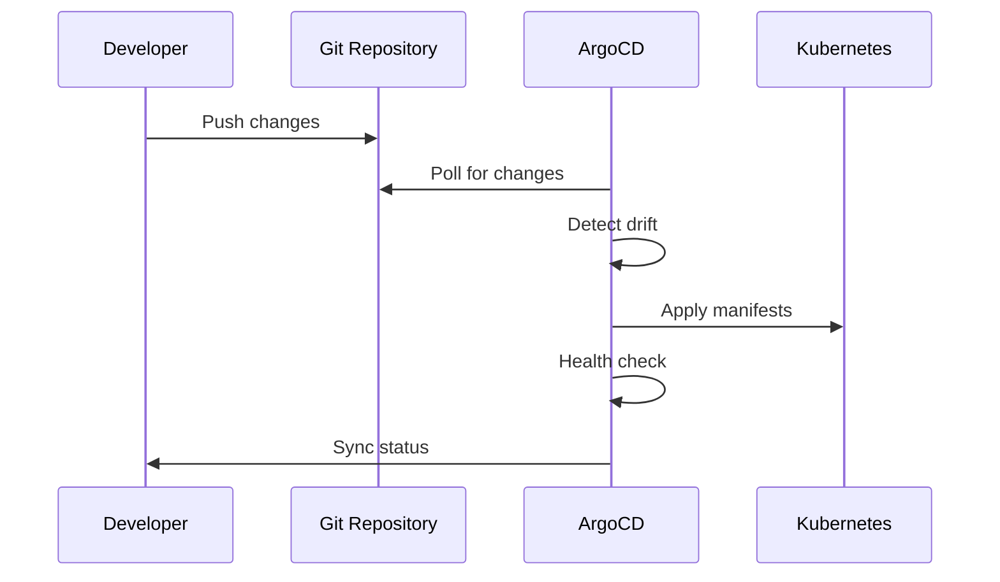

# ArgoCD GitOps Setup

This document explains the ArgoCD configuration and GitOps deployment patterns used in this monorepo.

## 🎯 Overview

ArgoCD provides continuous deployment using GitOps principles, automatically synchronizing Kubernetes resources from this Git repository. The setup includes infrastructure components and application services managed through ApplicationSets with support for multiple environments.

## 📁 Directory Structure

```
argocd/
├── appsets/                  # ArgoCD ApplicationSets
│   └── dev/                 # Development environment
│       ├── infra.yaml       # Infrastructure ApplicationSet
│       └── services.yaml    # Services ApplicationSet
├── infra/                   # Infrastructure components
│   ├── cert-manager/        # TLS certificate management (self-signed CA)
│   ├── cnpg-system/        # CloudNativePG operator
│   ├── external-secrets/    # External secrets with password generation
│   ├── kafka/              # Apache Kafka with Strimzi operator
│   ├── kafka-ui/           # Kafka management UI
│   ├── maildev/            # Development email server with SMTP
│   ├── minio/              # S3-compatible object storage
│   ├── reflector/          # Secret/ConfigMap replication
│   └── strimzi/            # Kafka operator
└── services/               # Application services
    ├── api/                # API gateway service
    ├── auth/               # Authentication service (socat proxy)
    ├── common/             # Shared database cluster and secrets
    └── temporal/           # Temporal server with UI (dev/prod envs)
```

## 🚀 ApplicationSets

ApplicationSets automatically create and manage ArgoCD Applications based on Git repository structure.

### Infrastructure ApplicationSet

Manages core infrastructure components with Go templating:

```yaml
apiVersion: argoproj.io/v1alpha1
kind: ApplicationSet
metadata:
  name: infra
  namespace: argocd
spec:
  ignoreApplicationDifferences:
    - jsonPointers:
        - /spec/syncPolicy
  goTemplate: true
  goTemplateOptions: ["missingkey=error"]
  generators:
    - git:
        repoURL: file:///mnt/monorepo-template.git
        revision: HEAD
        directories:
          - path: argocd/infra/*/envs/dev
  template:
    metadata:
      name: "{{ index .path.segments 2 }}"
    spec:
      project: default
      source:
        repoURL: file:///mnt/monorepo-template.git
        targetRevision: HEAD
        path: "{{ .path.path }}"
      destination:
        server: https://kubernetes.default.svc
        namespace: "{{ index .path.segments 2 }}"
      syncPolicy:
        automated:
          prune: true
          selfHeal: true
        syncOptions:
          - CreateNamespace=true
          - ApplyOutOfSyncOnly=true
```

### Services ApplicationSet

Manages application services in the `services` namespace:

```yaml
apiVersion: argoproj.io/v1alpha1
kind: ApplicationSet
metadata:
  name: services
  namespace: argocd
spec:
  ignoreApplicationDifferences:
    - jsonPointers:
        - /spec/syncPolicy
  goTemplate: true
  goTemplateOptions: ["missingkey=error"]
  generators:
    - git:
        repoURL: file:///mnt/monorepo-template.git
        revision: HEAD
        directories:
          - path: argocd/services/*/envs/dev
  template:
    metadata:
      name: "{{ index .path.segments 2 }}"
    spec:
      project: default
      source:
        repoURL: file:///mnt/monorepo-template.git
        targetRevision: HEAD
        path: "{{ .path.path }}"
      destination:
        server: https://kubernetes.default.svc
        namespace: services
      syncPolicy:
        automated:
          prune: true
          selfHeal: true
        syncOptions:
          - CreateNamespace=true
          - ApplyOutOfSyncOnly=true
```

## 🏗 Infrastructure Components

### cert-manager

- **Purpose**: Self-signed certificate authority for TLS
- **Features**: ClusterIssuer with self-signed CA, automatic certificate generation
- **Namespace**: `cert-manager`

```yaml
apiVersion: cert-manager.io/v1
kind: ClusterIssuer
metadata:
  name: selfsigned-cluster-issuer
spec:
  ca:
    secretName: selfsigned-ca
```

### CloudNativePG (CNPG)

- **Purpose**: PostgreSQL operator for database management
- **Features**: High availability, automated backups, logical replication
- **Namespace**: `cnpg-system`

### External Secrets Operator

- **Purpose**: Generate and manage secrets
- **Features**: Password generation, cluster-wide secret management
- **Namespace**: `external-secrets-system`

```yaml
apiVersion: generators.external-secrets.io/v1alpha1
kind: ClusterGenerator
metadata:
  name: password-64-length
spec:
  kind: Password
  generator:
    passwordSpec:
      length: 64
      symbols: 0
      noUpper: false
      allowRepeat: true
```

### Apache Kafka (Strimzi)

- **Purpose**: Event streaming platform with Kafka operator
- **Features**: KRaft mode, external TLS access, Kafka Connect integration
- **Namespace**: `kafka`

```yaml
apiVersion: kafka.strimzi.io/v1beta2
kind: Kafka
metadata:
  name: kafka-cluster
  annotations:
    strimzi.io/kraft: enabled
    strimzi.io/node-pools: enabled
spec:
  kafka:
    listeners:
      - name: plain
        port: 9092
        type: internal
        tls: false
      - name: external
        port: 9094
        type: cluster-ip
        tls: true
        configuration:
          brokers:
            - advertisedHost: broker0.127.0.0.1.nip.io
              advertisedPort: 9094
              broker: 0
```

### Kafka UI

- **Purpose**: Web-based Kafka management interface
- **Features**: Topic management, consumer monitoring
- **Namespace**: `kafka-ui`

### Maildev

- **Purpose**: Development email server with web UI and SMTP
- **Features**: SMTP server (port 1025), web interface (port 1080)
- **Namespace**: `maildev`
- **Access**: `maildev.127.0.0.1.nip.io`

### MinIO

- **Purpose**: S3-compatible object storage
- **Features**: Local object storage, S3 API compatibility
- **Namespace**: `minio`

### Reflector

- **Purpose**: Replicate secrets/configmaps across namespaces
- **Features**: Automatic secret synchronization
- **Namespace**: `reflector`

### Strimzi Operator

- **Purpose**: Kafka operator for managing Kafka clusters
- **Features**: Kafka deployment, scaling, configuration management
- **Namespace**: `strimzi`

## 🔧 Service Resources

### Authentication Service

- **Implementation**: Socat proxy to `host.docker.internal:4000`
- **Purpose**: Proxy authentication service running on host
- **Resources**: Deployment, Service, HTTPRoute
- **Namespace**: `services`

```yaml
apiVersion: apps/v1
kind: Deployment
metadata:
  name: socat-auth
spec:
  containers:
    - name: socat-auth
      image: alpine/socat:1.8.0.3
      args:
        - "-d"
        - "TCP4-LISTEN:4000,fork,reuseaddr"
        - "TCP4:host.docker.internal:4000"
```

### API Service

- **Purpose**: API gateway entry point
- **Resources**: HTTPRoute for routing
- **Namespace**: `services`

### Temporal Service

- **Server**: `temporalio/auto-setup:1.26.2` connected to CNPG
- **Database**: PostgreSQL via `cnpg-cluster-rw:5432`
- **gRPC Access**: `temporal-server.127.0.0.1.nip.io` via GRPCRoute
- **UI Access**: `temporal.127.0.0.1.nip.io` via HTTPRoute
- **Environments**: Separate dev and prod configurations
- **Namespace**: `services`

```yaml
apiVersion: apps/v1
kind: Deployment
metadata:
  name: temporal
spec:
  containers:
    - name: temporal
      image: temporalio/auto-setup:1.26.2
      env:
        - name: DB
          value: postgres12
        - name: POSTGRES_SEEDS
          value: cnpg-cluster-rw
        - name: POSTGRES_USER
          valueFrom:
            secretKeyRef:
              name: cnpg-cluster-admin
              key: username
```

### Common Resources

- **PostgreSQL Cluster**: Shared CNPG cluster with Voltade Postgres image
- **Database Features**: Logical replication, pgsodium, supabase_vault
- **Certificates**: TLS certificates for services
- **Secrets**: Cluster secret store and mailer configuration
- **Drizzle Gateway**: Database management UI at `drizzle.127.0.0.1.nip.io`

```yaml
apiVersion: postgresql.cnpg.io/v1
kind: Cluster
metadata:
  name: cnpg-cluster
spec:
  imageName: ghcr.io/voltade/postgres:17.5-20250805-859fe66
  instances: 1
  postgresql:
    parameters:
      wal_level: logical
      max_wal_senders: "10"
      max_replication_slots: "10"
      pgsodium.enable_event_trigger: "off"
    shared_preload_libraries:
      - supabase_vault
  managed:
    roles:
      - name: admin
        login: true
        superuser: true
        replication: true
```

## ⚙️ Configuration Patterns

### Environment-Based Structure

Each component follows the same pattern:

```
component/
├── base/               # Base Kustomization
│   ├── kustomization.yaml
│   └── *.yaml         # Resource definitions
└── envs/
    └── dev/           # Environment overlay
        └── kustomization.yaml
```

### Kustomization Structure

Base configuration:

```yaml
apiVersion: kustomize.config.k8s.io/v1beta1
kind: Kustomization
resources:
  - component-config.yaml
  - rbac.yaml
```

Environment overlay:

```yaml
apiVersion: kustomize.config.k8s.io/v1beta1
kind: Kustomization
resources:
  - ../../base
patchesStrategicMerge:
  - config-patch.yaml
```

### Sync Waves and Dependencies

Components use ArgoCD sync waves for ordered deployment:

```yaml
metadata:
  annotations:
    argocd.argoproj.io/sync-wave: "-1" # Deploy early
    argocd.argoproj.io/sync-options: SkipDryRunOnMissingResource=true
```

### Gateway API Routes

Services use Gateway API for ingress with Cilium Gateway:

**HTTPRoute Example:**

```yaml
apiVersion: gateway.networking.k8s.io/v1
kind: HTTPRoute
metadata:
  name: temporal-ui
spec:
  parentRefs:
    - name: cilium-gateway
      namespace: gateway
  hostnames:
    - temporal.127.0.0.1.nip.io
  rules:
    - backendRefs:
        - name: temporal-ui
          port: 8080
```

**GRPCRoute Example:**

```yaml
apiVersion: gateway.networking.k8s.io/v1
kind: GRPCRoute
metadata:
  name: temporal-server
spec:
  parentRefs:
    - name: cilium-gateway
      namespace: gateway
  hostnames:
    - temporal-server.127.0.0.1.nip.io
  rules:
    - backendRefs:
        - name: temporal
          port: 7233
```

## 🔄 Deployment Flow



### Automatic Synchronization

ArgoCD monitors the Git repository and automatically:

1. **Detects changes** in manifest files
2. **Validates resources** against Kubernetes API
3. **Applies changes** with proper ordering
4. **Monitors health** of deployed resources
5. **Self-heals** by reverting manual changes

### Sync Policies

```yaml
syncPolicy:
  automated:
    prune: true # Remove resources not in Git
    selfHeal: true # Revert manual changes
  syncOptions:
    - CreateNamespace=true # Auto-create namespaces
    - ApplyOutOfSyncOnly=true # Only sync changed resources
```

## 🔍 Monitoring and Troubleshooting

### ArgoCD UI

- Access via ArgoCD web interface
- View application health and sync status
- Browse resource tree and events

### Common Issues

**Sync Failures:**

```bash
# Check application status
kubectl get applications -n argocd

# View sync details
kubectl describe application <app-name> -n argocd
```

**Resource Dependencies:**

- Use sync waves for proper ordering
- Check resource readiness before dependent resources

**Secret Management:**

- Ensure external-secrets operator is healthy
- Verify secret store configurations

## 🛠 Management Commands

### Manual Sync

```bash
# Sync specific application
argocd app sync <application-name>

# Sync all applications
argocd app sync --all
```

### Application Management

```bash
# List applications
argocd app list

# Get application details
argocd app get <application-name>

# Set sync policy
argocd app set <application-name> --sync-policy automated
```

### Troubleshooting

```bash
# Check application health
argocd app health <application-name>

# View application logs
argocd app logs <application-name>

# Refresh application
argocd app refresh <application-name>
```

## 🔐 Security Considerations

### RBAC

- ArgoCD service account with minimal required permissions
- Namespace-scoped access for applications
- Role-based access control for ArgoCD users

### Secret Management

- External secrets operator for sensitive data
- No plain-text secrets in Git repository
- Automated secret rotation capabilities

### Network Policies

- Restricted network access between namespaces
- Gateway API with proper TLS termination where applicable

## 🌐 Service Endpoints

The following services are exposed via Gateway API routes using `*.127.0.0.1.nip.io` domains:

| Service         | URL                                | Protocol  | Purpose                      |
| --------------- | ---------------------------------- | --------- | ---------------------------- |
| Temporal UI     | `temporal.127.0.0.1.nip.io`        | HTTP      | Temporal workflow management |
| Temporal Server | `temporal-server.127.0.0.1.nip.io` | gRPC      | Temporal gRPC API            |
| Maildev         | `maildev.127.0.0.1.nip.io`         | HTTP      | Email testing interface      |
| Drizzle Gateway | `drizzle.127.0.0.1.nip.io`         | HTTP      | Database management UI       |
| Kafka Bootstrap | `broker0.127.0.0.1.nip.io:9094`    | Kafka/TLS | Kafka external access        |

## 📦 Component Summary

### Infrastructure Layer

- **Strimzi**: Kafka operator and clusters
- **CNPG**: PostgreSQL operator and database clusters
- **cert-manager**: Self-signed certificate management
- **external-secrets**: Password generation and secret management
- **Reflector**: Cross-namespace secret replication

### Platform Services

- **Kafka**: Event streaming with external TLS access
- **Kafka UI**: Web-based Kafka management
- **Maildev**: SMTP server and email testing
- **MinIO**: S3-compatible object storage

### Application Services

- **Temporal**: Workflow orchestration (server + UI)
- **Auth Service**: Socat proxy to host-based auth service
- **API Gateway**: Service routing and entry point
- **Database**: Shared PostgreSQL with Voltade extensions

This GitOps setup provides a robust, automated deployment pipeline that ensures consistency between Git repository state and Kubernetes cluster resources while maintaining security and operational best practices.
