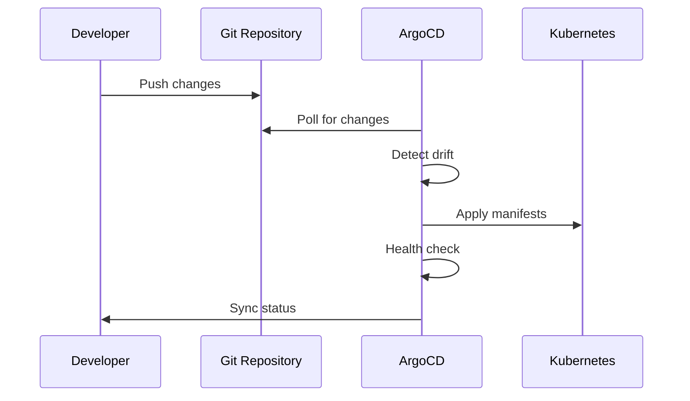

# ArgoCD GitOps Setup

This document explains the ArgoCD configuration and GitOps deployment patterns used in this monorepo.

## 🎯 Overview

ArgoCD provides continuous deployment using GitOps principles, automatically synchronizing Kubernetes resources from this Git repository. The setup includes infrastructure components and application services managed through ApplicationSets.

## 📁 Directory Structure

```
argocd/
├── appsets/                  # ArgoCD ApplicationSets
│   └── dev/                 # Development environment
│       ├── infra.yaml       # Infrastructure ApplicationSet
│       └── services.yaml    # Services ApplicationSet
├── infra/                   # Infrastructure components
│   ├── cert-manager/        # TLS certificate management
│   ├── external-secrets/    # External secret operator
│   ├── cnpg-system/        # CloudNativePG operator
│   ├── maildev/            # Development email server
│   ├── minio/              # S3-compatible object storage
│   └── reflector/          # Secret/ConfigMap replication
└── services/               # Application services
    ├── auth/               # Authentication service
    ├── api/                # API gateway service
    ├── temporal/           # Temporal server and UI
    └── common/             # Shared resources (database)
```

## 🚀 ApplicationSets

ApplicationSets automatically create and manage ArgoCD Applications based on Git repository structure.

### Infrastructure ApplicationSet

Manages core infrastructure components:

```yaml
apiVersion: argoproj.io/v1alpha1
kind: ApplicationSet
metadata:
  name: infra
  namespace: argocd
spec:
  generators:
    - git:
        repoURL: file:///mnt/monorepo-template.git
        revision: HEAD
        directories:
          - path: argocd/infra/*/envs/dev
  template:
    spec:
      source:
        path: "{{ .path.path }}"
      destination:
        namespace: "{{ index .path.segments 2 }}"
      syncPolicy:
        automated:
          prune: true
          selfHeal: true
```

### Services ApplicationSet

Manages application services:

```yaml
apiVersion: argoproj.io/v1alpha1
kind: ApplicationSet
metadata:
  name: services
  namespace: argocd
spec:
  generators:
    - git:
        directories:
          - path: argocd/services/*/envs/dev
  template:
    spec:
      destination:
        namespace: services
      syncPolicy:
        automated:
          prune: true
          selfHeal: true
```

## 🏗 Infrastructure Components

### cert-manager

- **Purpose**: Automatic TLS certificate provisioning
- **Features**: Let's Encrypt integration, certificate renewal
- **Namespace**: `cert-manager`

### CloudNativePG (CNPG)

- **Purpose**: PostgreSQL operator for database management
- **Features**: High availability, automated backups, monitoring
- **Namespace**: `cnpg-system`

```yaml
apiVersion: postgresql.cnpg.io/v1
kind: Cluster
metadata:
  name: cnpg-cluster
spec:
  instances: 1
  storage:
    size: 4Gi
  postgresql:
    parameters:
      pgsodium.enable_event_trigger: "off"
  managed:
    roles:
      - name: admin
        login: true
        superuser: true
```

### External Secrets Operator

- **Purpose**: Sync secrets from external systems
- **Features**: AWS Secrets Manager, Kubernetes secrets
- **Namespace**: `external-secrets-system`

### Maildev

- **Purpose**: Development email server with web UI
- **Features**: SMTP server, email viewer interface
- **Namespace**: `maildev`

### MinIO

- **Purpose**: S3-compatible object storage
- **Features**: Local object storage, S3 API compatibility
- **Namespace**: `minio`

### Reflector

- **Purpose**: Replicate secrets/configmaps across namespaces
- **Features**: Automatic secret synchronization
- **Namespace**: `reflector`

## 🔧 Service Resources

### Authentication Service

- **Database**: Dedicated PostgreSQL instance via CNPG
- **Resources**: Deployment, Service, HTTPRoute
- **Namespace**: `services`

### API Service

- **Purpose**: API gateway entry
- **Resources**: Deployment, Service, HTTPRoute
- **Namespace**: `services`

### Temporal Service

- **Server**: `temporalio/auto-setup` wired to CNPG via `cnpg-cluster-rw:5432`
- **Access**: gRPC via `GRPCRoute` host `temporal-server.127.0.0.1.nip.io:80`
- **UI**: `temporalio/ui` with `HTTPRoute` host `temporal.127.0.0.1.nip.io`
- **Namespace**: `services`

### Common Resources

- **PostgreSQL Cluster**: Shared database infrastructure
- **Certificates**: TLS certificates for services
- **Secrets**: Shared configuration and credentials

## ⚙️ Configuration Patterns

### Environment-Based Structure

Each component follows the same pattern:

```
component/
├── base/               # Base Kustomization
│   ├── kustomization.yaml
│   └── *.yaml         # Resource definitions
└── envs/
    └── dev/           # Environment overlay
        └── kustomization.yaml
```

### Kustomization Structure

Base configuration:

```yaml
apiVersion: kustomize.config.k8s.io/v1beta1
kind: Kustomization
resources:
  - component-config.yaml
  - rbac.yaml
```

Environment overlay:

```yaml
apiVersion: kustomize.config.k8s.io/v1beta1
kind: Kustomization
resources:
  - ../../base
patchesStrategicMerge:
  - config-patch.yaml
```

### Sync Waves and Dependencies

Components use ArgoCD sync waves for ordered deployment:

```yaml
metadata:
  annotations:
    argocd.argoproj.io/sync-wave: "-1" # Deploy early
    argocd.argoproj.io/sync-options: SkipDryRunOnMissingResource=true
```

## 🔄 Deployment Flow



### Automatic Synchronization

ArgoCD monitors the Git repository and automatically:

1. **Detects changes** in manifest files
2. **Validates resources** against Kubernetes API
3. **Applies changes** with proper ordering
4. **Monitors health** of deployed resources
5. **Self-heals** by reverting manual changes

### Sync Policies

```yaml
syncPolicy:
  automated:
    prune: true # Remove resources not in Git
    selfHeal: true # Revert manual changes
  syncOptions:
    - CreateNamespace=true # Auto-create namespaces
    - ApplyOutOfSyncOnly=true # Only sync changed resources
```

## 🔍 Monitoring and Troubleshooting

### ArgoCD UI

- Access via ArgoCD web interface
- View application health and sync status
- Browse resource tree and events

### Common Issues

**Sync Failures:**

```bash
# Check application status
kubectl get applications -n argocd

# View sync details
kubectl describe application <app-name> -n argocd
```

**Resource Dependencies:**

- Use sync waves for proper ordering
- Check resource readiness before dependent resources

**Secret Management:**

- Ensure external-secrets operator is healthy
- Verify secret store configurations

## 🛠 Management Commands

### Manual Sync

```bash
# Sync specific application
argocd app sync <application-name>

# Sync all applications
argocd app sync --all
```

### Application Management

```bash
# List applications
argocd app list

# Get application details
argocd app get <application-name>

# Set sync policy
argocd app set <application-name> --sync-policy automated
```

### Troubleshooting

```bash
# Check application health
argocd app health <application-name>

# View application logs
argocd app logs <application-name>

# Refresh application
argocd app refresh <application-name>
```

## 🔐 Security Considerations

### RBAC

- ArgoCD service account with minimal required permissions
- Namespace-scoped access for applications
- Role-based access control for ArgoCD users

### Secret Management

- External secrets operator for sensitive data
- No plain-text secrets in Git repository
- Automated secret rotation capabilities

### Network Policies

- Restricted network access between namespaces
- Gateway API with proper TLS termination where applicable

This GitOps setup provides a robust, automated deployment pipeline that ensures consistency between Git repository state and Kubernetes cluster resources while maintaining security and operational best practices.
