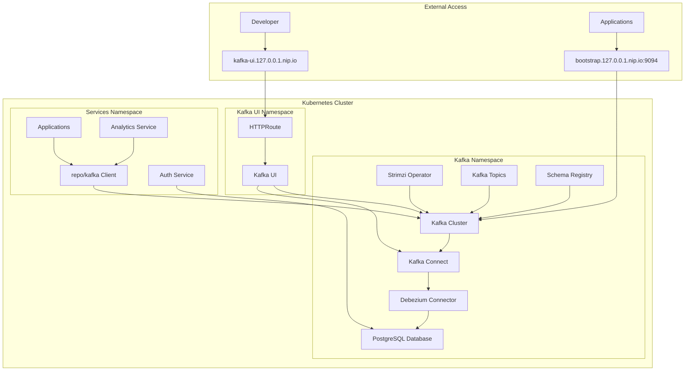
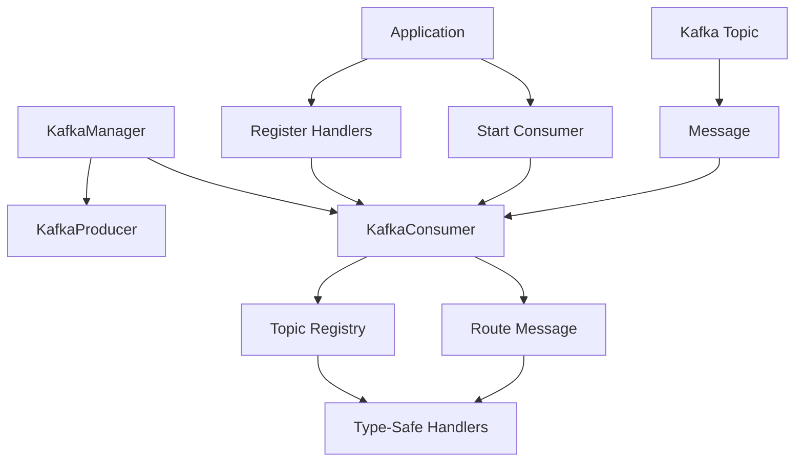

# Kafka Client Package

This document provides comprehensive documentation for the `@repo/kafka` package - a type-safe, powerful Kafka client built for microservices architecture.

## 📋 Table of Contents

- [Overview](#-overview)
- [Architecture](#-architecture)
- [Quick Start](#-quick-start)
- [API Reference](#-api-reference)
- [Type-Safe Topic Handlers](#-type-safe-topic-handlers)
- [Advanced Usage](#-advanced-usage)
- [Best Practices](#-best-practices)
- [Troubleshooting](#-troubleshooting)

## 🎯 Overview

The `@repo/kafka` package provides a comprehensive Kafka client with the following features:

### **Key Features**

- ✅ **Type-Safe Message Handling** - Full TypeScript support with generic message types
- ✅ **Topic Registry System** - Register typed handlers for specific topics
- ✅ **Automatic Message Routing** - Messages are automatically routed to the correct handler
- ✅ **Connection Management** - Robust connection handling with retry logic
- ✅ **Error Isolation** - Individual handler failures don't affect other topics
- ✅ **Production Ready** - Built-in logging, error handling, and graceful shutdown

### **Use Cases**

- **Event-Driven Architecture** - Handle database change events (CDC)
- **Microservice Communication** - Asynchronous service-to-service messaging
- **Analytics Pipelines** - Process and route analytics events
- **Real-time Notifications** - Handle user activity and notification events

## 🏗 Architecture

### **Infrastructure Overview**



### **Core Components**



### **Package Structure**

```
packages/kafka/src/
├── client.ts          # Kafka client configuration
├── config.ts          # Configuration types and utilities
├── consumer.ts        # Consumer with topic registry
├── producer.ts        # Producer for sending messages
├── manager.ts         # High-level manager for multiple clients
├── types.ts           # Common types (DatabaseEvent, etc.)
└── index.ts           # Main exports
```

## 🚀 Quick Start

### **1. Installation**

The package is already included in the monorepo. Import it in your application:

```typescript
import { KafkaManager, DatabaseEvent } from "@repo/kafka";
```

### **2. Basic Setup**

```typescript
// kafka.ts - Create Kafka instances
import { KafkaManager } from "@repo/kafka";

export const kafkaManager = new KafkaManager({
  clientId: "your-service-name",
  nodeEnv: "development",
  ssl: true,
  retry: {
    initialRetryTime: 100,
    retries: 8,
  },
});

export const consumer = kafkaManager.createConsumer("main", {
  groupId: "your-service-group",
  sessionTimeout: 30000,
  heartbeatInterval: 3000,
});

export const producer = kafkaManager.createProducer("main", {
  maxInFlightRequests: 1,
  idempotent: true,
});
```

### **3. Register Type-Safe Handlers**

```typescript
// index.ts - Your application entry point
import { DatabaseEvent } from "@repo/kafka";
import { sessions } from "@repo/db-auth/schema";
import { consumer } from "./kafka";

async function main() {
  // Connect to Kafka
  await consumer.connect();

  // Register typed handlers for specific topics
  consumer.registerHandler<DatabaseEvent<typeof sessions.$inferSelect>>(
    "auth.public.sessions",
    async (message) => {
      // Full type safety - TypeScript knows the exact structure
      console.log("New session:", message.after.id);
      console.log("User ID:", message.after.userId);

      // Process the session event
      await processSessionEvent(message);
    }
  );

  // Start consuming all registered topics
  await consumer.startWithHandlers();
  console.log("Kafka consumer is running...");
}
```

### **4. Graceful Shutdown**

```typescript
// Graceful shutdown
process.on("SIGTERM", async () => {
  await kafkaManager.disconnectAll();
  process.exit(0);
});

process.on("SIGINT", async () => {
  await kafkaManager.disconnectAll();
  process.exit(0);
});
```

## 🏗️ Kafka Infrastructure Setup

This section documents the complete Kafka infrastructure setup using Strimzi operator and how it integrates with the `@repo/kafka` client.

### **Strimzi Operator Deployment**

The Kafka cluster is managed by the [Strimzi](https://strimzi.io/) operator for Kubernetes.

#### **Operator Installation**

```yaml
# argocd/infra/strimzi/base/kustomization.yaml
helmCharts:
  - name: strimzi-kafka-operator
    namespace: kafka
    releaseName: strimzi-kafka-operator
    repo: https://strimzi.io/charts/
    version: 0.45.1
    includeCRDs: true
```

### **Kafka Cluster Configuration**

#### **Kafka Cluster Resource**

```yaml
# argocd/infra/kafka/base/kafka.yaml
apiVersion: kafka.strimzi.io/v1beta2
kind: Kafka
metadata:
  name: kafka-cluster
  annotations:
    strimzi.io/kraft: enabled # Uses KRaft mode (no Zookeeper)
    strimzi.io/node-pools: enabled # Uses node pools for scaling
spec:
  kafka:
    listeners:
      - name: plain # Internal plaintext (9092)
        port: 9092
        type: internal
        tls: false
      - name: tls # Internal TLS (9093)
        port: 9093
        type: internal
        tls: true
      - name: external # External TLS (9094)
        port: 9094
        type: cluster-ip
        tls: true
        configuration:
          brokers:
            - advertisedHost: broker0.127.0.0.1.nip.io
              advertisedPort: 9094
              broker: 0
          brokerCertChainAndKey:
            certificate: tls.crt
            key: tls.key
            secretName: kafka-bootstrap-tls
    config:
      # Single replica configuration for development
      offsets.topic.replication.factor: 1
      transaction.state.log.replication.factor: 1
      transaction.state.log.min.isr: 1
      default.replication.factor: 1
      min.insync.replicas: 1
  entityOperator:
    topicOperator: {} # Manages Kafka topics
    userOperator: {} # Manages Kafka users
```

#### **Node Pool Configuration**

```yaml
# argocd/infra/kafka/base/kafka-node-pool.yaml
apiVersion: kafka.strimzi.io/v1beta2
kind: KafkaNodePool
metadata:
  name: dual-role
  labels:
    strimzi.io/cluster: kafka-cluster
spec:
  replicas: 1
  roles:
    - controller # KRaft controller role
    - broker # Kafka broker role
  storage:
    type: jbod
    volumes:
      - id: 0
        type: persistent-claim
        size: 2Gi
        deleteClaim: true
        kraftMetadata: shared # Shared metadata for KRaft
```

### **External Access Configuration**

#### **Traefik TCP Route**

```yaml
# argocd/infra/kafka/envs/dev/kafka-route.yaml
apiVersion: traefik.io/v1alpha1
kind: IngressRouteTCP
metadata:
  name: kafka-bootstrap
spec:
  entryPoints:
    - kafka # Traefik entrypoint on port 9094
  routes:
    - match: HostSNI(`bootstrap.127.0.0.1.nip.io`)
      services:
        - name: kafka-cluster-kafka-external-bootstrap
          port: 9094
    - match: HostSNI(`broker0.127.0.0.1.nip.io`)
      services:
        - name: kafka-cluster-dual-role-0
          port: 9094
  tls:
    secretName: kafka-bootstrap-tls
    passthrough: true
```

### **Kafka Connect & CDC Setup**

#### **Kafka Connect Cluster**

```yaml
# argocd/infra/kafka/base/kafka-connect.yaml
apiVersion: kafka.strimzi.io/v1beta2
kind: KafkaConnect
metadata:
  name: kafka-connect-cluster
  annotations:
    strimzi.io/use-connector-resources: "true"
spec:
  replicas: 1
  image: registry.127.0.0.1.nip.io/debezium-connect-postgres:latest
  bootstrapServers: kafka-cluster-kafka-bootstrap:9092
  config:
    group.id: connect-cluster
    offset.storage.topic: connect-cluster-offsets
    config.storage.topic: connect-cluster-configs
    status.storage.topic: connect-cluster-status
    key.converter: org.apache.kafka.connect.json.JsonConverter
    value.converter: org.apache.kafka.connect.json.JsonConverter
    key.converter.schemas.enable: "false"
    value.converter.schemas.enable: "false"
```

#### **Debezium PostgreSQL Connector**

```yaml
# argocd/infra/kafka/base/connectors/auth.yaml
apiVersion: kafka.strimzi.io/v1beta2
kind: KafkaConnector
metadata:
  name: kafka-connector-auth
  labels:
    strimzi.io/cluster: kafka-connect-cluster
spec:
  class: io.debezium.connector.postgresql.PostgresConnector
  tasksMax: 1
  config:
    database.hostname: cnpg-cluster-rw.services.svc.cluster.local
    database.port: 5432
    database.user: ${secrets:services/cnpg-cluster-admin:username}
    database.password: ${secrets:services/cnpg-cluster-admin:password}
    database.dbname: auth
    topic.prefix: auth # Topics: auth.public.users, auth.public.sessions
    slot.name: debezium_auth
    publication.name: debezium_auth_publication
    publication.autocreate.mode: all_tables
    snapshot.mode: when_needed
    tombstones.on.delete: false
```

#### **Custom Debezium Image**

```dockerfile
# docker/debezium-connect-postgres/Dockerfile
FROM quay.io/strimzi/kafka:0.45.1-kafka-3.9.1

ARG DEBEZIUM_VERSION=3.2.1.Final
ENV DEBEZIUM_VERSION=${DEBEZIUM_VERSION}
ENV KAFKA_CONNECT_PLUGINS_DIR=/opt/kafka/plugins/debezium

USER root:root
RUN mkdir -p $KAFKA_CONNECT_PLUGINS_DIR

COPY debezium-connector-postgres-$DEBEZIUM_VERSION-plugin.tar.gz \
     $KAFKA_CONNECT_PLUGINS_DIR/debezium-postgres-plugin.tar.gz

RUN tar -xzf $KAFKA_CONNECT_PLUGINS_DIR/debezium-postgres-plugin.tar.gz \
           -C $KAFKA_CONNECT_PLUGINS_DIR
```

### **Kafka UI Setup**

#### **Kafka UI Deployment**

```yaml
# argocd/infra/kafka-ui/base/kustomization.yaml
helmCharts:
  - name: kafka-ui
    namespace: kafka-ui
    releaseName: kafka-ui
    repo: https://kafbat.github.io/helm-charts
    valuesInline:
      yamlApplicationConfig:
        kafka:
          clusters:
            - name: kafka-cluster
              bootstrapServers: kafka-cluster-kafka-bootstrap.kafka.svc.cluster.local:9092
              kafkaConnect:
                - name: kafka-connect-cluster
                  address: http://kafka-connect-cluster-connect-api.kafka.svc.cluster.local:8083
      service:
        type: ClusterIP
        port: 8080
      resources:
        limits:
          cpu: 200m
          memory: 512Mi
        requests:
          cpu: 100m
          memory: 256Mi
```

#### **Web Access Route**

```yaml
# argocd/infra/kafka-ui/base/httproute.yaml
apiVersion: gateway.networking.k8s.io/v1
kind: HTTPRoute
metadata:
  name: kafka-ui
  namespace: kafka-ui
spec:
  parentRefs:
    - name: cilium-gateway
      namespace: gateway
  hostnames:
    - kafka-ui.127.0.0.1.nip.io # Access Kafka UI here
  rules:
    - matches:
        - path:
            type: PathPrefix
            value: /
      backendRefs:
        - name: kafka-ui
          port: 8080
```

### **Client Integration**

#### **Connection Configuration**

```typescript
// packages/kafka/src/config.ts
export const LOCAL_KAFKA_CONFIG = {
  bootstrap: ["bootstrap.127.0.0.1.nip.io:9094"],  // External TLS endpoint
};

export const KUBERNETES_INTERNAL_SERVICE_MAP = {
  bootstrap: ["kafka-cluster-dual-role-0.kafka.svc.cluster.local:9094"],
};

export function getKafkaConfig(ENV: "production" | "development") {
  if (ENV === "production") {
    return KUBERNETES_INTERNAL_SERVICE_MAP;
  } else {
    return LOCAL_KAFKA_CONFIG;
  }
}
```

#### **Client Setup**

```typescript
// Application kafka.ts
import { KafkaManager } from "@repo/kafka";

export const kafkaManager = new KafkaManager({
  clientId: "analytics-service",
  nodeEnv: process.env.NODE_ENV as "development" | "production",
  ssl: true,                                    // Required for external access
  retry: {
    initialRetryTime: 100,
    retries: 8,
  },
});
```

### **Topic Management**

#### **Automatic Topic Creation**

Topics are automatically created by Debezium based on database tables:

| Database Table         | Kafka Topic            | Description           |
| ---------------------- | ---------------------- | --------------------- |
| `auth.public.users`    | `auth.public.users`    | User table changes    |
| `auth.public.sessions` | `auth.public.sessions` | Session table changes |
| `auth.public.accounts` | `auth.public.accounts` | Account table changes |

#### **Topic Naming Convention**

```
{database}.{schema}.{table}
```

Examples:

- `auth.public.users` - User authentication data
- `auth.public.sessions` - Session management
- `orders.public.orders` - Order processing
- `analytics.public.events` - Analytics events

### **Monitoring & Management**

#### **Access Points**

| Service           | URL                              | Purpose                            |
| ----------------- | -------------------------------- | ---------------------------------- |
| Kafka UI          | http://kafka-ui.127.0.0.1.nip.io | Browse topics, messages, consumers |
| Kafka Bootstrap   | bootstrap.127.0.0.1.nip.io:9094  | Client connections                 |
| Kafka Connect API | Internal only                    | Connector management               |

#### **Kafka UI Features**

- **Topic Browser** - View messages and schemas
- **Consumer Groups** - Monitor consumer lag and status
- **Connect Clusters** - Manage Kafka Connect connectors
- **Schema Registry** - View and manage schemas
- **Cluster Metrics** - Monitor cluster health

#### **Useful kubectl Commands**

```bash
# Check Kafka cluster status
kubectl get kafka -n kafka

# View Kafka topics
kubectl get kafkatopics -n kafka

# Check connector status
kubectl get kafkaconnectors -n kafka

# View Kafka Connect logs
kubectl logs -f deployment/kafka-connect-cluster-connect -n kafka

# Scale Kafka brokers
kubectl patch kafkanodepool dual-role -n kafka --type='merge' -p='{"spec":{"replicas":3}}'
```

### **Development Workflow**

#### **1. Deploy Infrastructure**

```bash
# Deploy Kafka operator and cluster
kubectl apply -k argocd/infra/strimzi/envs/dev
kubectl apply -k argocd/infra/kafka/envs/dev
kubectl apply -k argocd/infra/kafka-ui/envs/dev
```

#### **2. Verify Deployment**

```bash
# Check if Kafka is ready
kubectl wait --for=condition=Ready kafka/kafka-cluster -n kafka --timeout=300s

# Check connector status
kubectl get kafkaconnectors -n kafka
```

#### **3. Access Kafka UI**

Open http://kafka-ui.127.0.0.1.nip.io to:

- Browse topics and messages
- Monitor consumer groups
- View connector status
- Inspect schemas

#### **4. Test Client Connection**

```typescript
// Test connection in your application
const consumer = kafkaManager.createConsumer("test", {
  groupId: "test-group",
});

await consumer.connect();
console.log("Connected to Kafka!");
```

### **Security Configuration**

#### **TLS Certificates**

```yaml
# Automatic certificate management
spec:
  kafka:
    listeners:
      - name: external
        tls: true
        configuration:
          brokerCertChainAndKey:
            certificate: tls.crt
            key: tls.key
            secretName: kafka-bootstrap-tls # Auto-generated by Strimzi
```

#### **Secret Management**

```yaml
# Database credentials from Kubernetes secrets
config:
  database.user: ${secrets:services/cnpg-cluster-admin:username}
  database.password: ${secrets:services/cnpg-cluster-admin:password}
```

### **Troubleshooting Infrastructure**

#### **Common Issues**

**Kafka Not Starting:**

```bash
# Check operator logs
kubectl logs -f deployment/strimzi-cluster-operator -n kafka

# Check node pool status
kubectl describe kafkanodepool dual-role -n kafka
```

**Connect Cluster Issues:**

```bash
# Check connector status
kubectl describe kafkaconnector kafka-connector-auth -n kafka

# View connect logs
kubectl logs -f deployment/kafka-connect-cluster-connect -n kafka
```

**Client Connection Issues:**

```bash
# Test connectivity from inside cluster
kubectl run kafka-test --image=confluentinc/cp-kafka --rm -it -- \
  kafka-topics --bootstrap-server kafka-cluster-kafka-bootstrap:9092 --list
```

**External Access Issues:**

```bash
# Check Traefik route
kubectl describe ingressroutetcp kafka-bootstrap -n kafka

# Test TLS connection
openssl s_client -connect bootstrap.127.0.0.1.nip.io:9094 -servername bootstrap.127.0.0.1.nip.io
```

## 📚 API Reference

### **KafkaManager**

Central manager for creating and managing multiple Kafka clients.

```typescript
class KafkaManager {
  constructor(options: KafkaClientOptions)

  // Create a producer instance
  createProducer(name: string, options?: ProducerOptions): KafkaProducer

  // Create a consumer instance
  createConsumer(name: string, options: ConsumerOptions): KafkaConsumer

  // Disconnect all clients
  async disconnectAll(): Promise<void>

  // Get existing instances
  getProducer(name: string): KafkaProducer | undefined
  getConsumer(name: string): KafkaConsumer | undefined
}
```

### **KafkaConsumer**

Enhanced consumer with built-in topic registry for type-safe message handling.

#### **Connection Management**

```typescript
class KafkaConsumer {
  // Connect to Kafka
  async connect(): Promise<void>

  // Disconnect from Kafka
  async disconnect(): Promise<void>

  // Check connection status
  isConnected(): boolean
}
```

#### **Topic Registry Methods**

```typescript
// Register a typed handler for a specific topic
registerHandler<T>(topic: string, handler: TopicHandler<T>): void

// Start consuming all registered topics
async startWithHandlers(): Promise<void>

// Unregister a handler
unregisterHandler(topic: string): void

// Get all registered topics
getRegisteredTopics(): string[]

// Check if a topic has a handler
hasHandler(topic: string): boolean

// Clear all handlers
clearHandlers(): void

// Check if running with handlers
isRunningHandlers(): boolean
```

#### **Traditional Consumer Methods**

```typescript
// Subscribe to a topic manually
async subscribe(options: SubscribeOptions): Promise<void>

// Run with custom message handler
async run(messageHandler: MessageHandler): Promise<void>

// Run with typed message handler
async runTyped<T>(messageHandler: TypedMessageHandler<T>): Promise<void>
```

### **KafkaProducer**

Producer for sending messages to Kafka topics.

```typescript
class KafkaProducer {
  // Connect to Kafka
  async connect(): Promise<void>

  // Disconnect from Kafka
  async disconnect(): Promise<void>

  // Send messages to a topic
  async send(topic: string, messages: MessagePayload[]): Promise<RecordMetadata[]>

  // Check connection status
  isConnected(): boolean
}
```

### **Type Definitions**

```typescript
// Topic handler function
type TopicHandler<T = any> = (message: T) => Promise<void>;

// Message payload for producers
interface MessagePayload {
  key?: string;
  value: string;
  partition?: number;
  headers?: Record<string, string>;
}

// Database change event (CDC)
interface DatabaseEvent<T> {
  before: T | null;
  after: T;
  source: {
    version: string;
    connector: string;
    name: string;
    ts_ms: number;
    schema: string;
    table: string;
    // ... more source metadata
  };
  op: "c" | "u" | "d" | "r"; // create, update, delete, read
  ts_ms: number;
}
```

## 🎯 Type-Safe Topic Handlers

### **Basic Handler Registration**

```typescript
// Simple message handler
consumer.registerHandler<{ userId: string; action: string }>(
  "user.actions",
  async (message) => {
    console.log(`User ${message.userId} performed: ${message.action}`);
  }
);
```

### **Database Change Events**

```typescript
import { DatabaseEvent } from "@repo/kafka";
import { users } from "@repo/db-auth/schema";

// Handle user table changes
consumer.registerHandler<DatabaseEvent<typeof users.$inferSelect>>(
  "auth.public.users",
  async (event) => {
    switch (event.op) {
      case "c": // Create
        console.log("New user created:", event.after.email);
        await onUserCreated(event.after);
        break;

      case "u": // Update
        console.log("User updated:", event.after.id);
        console.log("Before:", event.before);
        console.log("After:", event.after);
        await onUserUpdated(event.before, event.after);
        break;

      case "d": // Delete
        console.log("User deleted:", event.before?.id);
        await onUserDeleted(event.before);
        break;
    }
  }
);
```

### **Multiple Topic Handlers**

```typescript
// Register multiple handlers for different topics
consumer.registerHandler<SessionEvent>(
  "auth.sessions",
  async (message) => {
    await analytics.trackSession(message);
  }
);

consumer.registerHandler<OrderEvent>(
  "orders.events",
  async (message) => {
    await fulfillment.processOrder(message);
  }
);

consumer.registerHandler<NotificationEvent>(
  "notifications.send",
  async (message) => {
    await mailer.sendEmail(message);
  }
);

// Start consuming all registered topics
await consumer.startWithHandlers();
```

### **Error Handling**

```typescript
consumer.registerHandler<DatabaseEvent<UserData>>(
  "auth.public.users",
  async (message) => {
    try {
      await processUserEvent(message);
    } catch (error) {
      // Log error - the framework will handle retries
      console.error("Failed to process user event:", error);

      // Optionally send to dead letter queue
      await deadLetterQueue.send("failed.user.events", message);

      // Re-throw to trigger Kafka's retry mechanism
      throw error;
    }
  }
);
```

## 🔧 Advanced Usage

### **Custom Message Parsing**

The consumer automatically parses JSON messages, but you can customize parsing:

```typescript
// The consumer handles this automatically, but here's how it works internally:
const parseMessage = (value: Buffer): any => {
  try {
    return JSON.parse(value.toString());
  } catch (error) {
    console.error("Failed to parse JSON:", error);
    return value.toString(); // Return raw string if JSON parsing fails
  }
};
```

### **Dynamic Topic Registration**

```typescript
// Register topics dynamically based on configuration
const topicsConfig = [
  { name: "auth.sessions", handler: handleSessionEvent },
  { name: "auth.users", handler: handleUserEvent },
  { name: "orders.events", handler: handleOrderEvent },
];

for (const { name, handler } of topicsConfig) {
  consumer.registerHandler(name, handler);
}

await consumer.startWithHandlers();
```

### **Conditional Handler Registration**

```typescript
// Register handlers based on environment or feature flags
if (process.env.ENABLE_ANALYTICS === "true") {
  consumer.registerHandler<AnalyticsEvent>(
    "analytics.events",
    async (message) => {
      await analytics.track(message);
    }
  );
}

if (featureFlags.notifications) {
  consumer.registerHandler<NotificationEvent>(
    "notifications.send",
    async (message) => {
      await notifications.send(message);
    }
  );
}
```

### **Producer Usage**

```typescript
// Send messages to topics
await producer.connect();

await producer.send("user.events", [
  {
    key: userId,
    value: JSON.stringify({
      event: "user_login",
      userId,
      timestamp: Date.now(),
    }),
  },
]);
```

## 📋 Best Practices

### **1. Topic Naming Conventions**

```typescript
// Use hierarchical naming with dots
"auth.public.users"      // Database table changes
"auth.sessions"          // Session events
"orders.payments"        // Payment events
"notifications.email"    // Email notifications
"analytics.user_events"  // Analytics events
```

### **2. Message Schema Design**

```typescript
// Always include metadata in your messages
interface UserEvent {
  eventType: "created" | "updated" | "deleted";
  userId: string;
  timestamp: number;
  source: string;
  data: UserData;
  metadata?: Record<string, any>;
}
```

### **3. Error Handling Strategy**

```typescript
consumer.registerHandler<DatabaseEvent<UserData>>(
  "auth.public.users",
  async (message) => {
    try {
      await processMessage(message);
    } catch (error) {
      // Log with context
      console.error("Message processing failed:", {
        topic: "auth.public.users",
        offset: message.source.ts_ms,
        error: error.message,
      });

      // Implement retry logic or dead letter queue
      if (error instanceof RetryableError) {
        throw error; // Let Kafka retry
      } else {
        await deadLetterQueue.send(message);
        // Don't re-throw for non-retryable errors
      }
    }
  }
);
```

### **4. Resource Management**

```typescript
// Always clean up resources
const gracefulShutdown = async () => {
  console.log("Shutting down gracefully...");

  // Stop consuming new messages
  await consumer.disconnect();

  // Close producer connections
  await producer.disconnect();

  // Disconnect manager (handles all clients)
  await kafkaManager.disconnectAll();

  process.exit(0);
};

process.on("SIGTERM", gracefulShutdown);
process.on("SIGINT", gracefulShutdown);
```

### **5. Testing**

```typescript
// Mock Kafka for testing
jest.mock("@repo/kafka", () => ({
  KafkaManager: jest.fn().mockImplementation(() => ({
    createConsumer: jest.fn().mockReturnValue({
      connect: jest.fn(),
      registerHandler: jest.fn(),
      startWithHandlers: jest.fn(),
    }),
  })),
}));

// Test your handlers in isolation
describe("User Event Handler", () => {
  it("should process user creation events", async () => {
    const mockEvent: DatabaseEvent<UserData> = {
      op: "c",
      after: { id: "123", email: "test@example.com" },
      // ... rest of event
    };

    await handleUserEvent(mockEvent);

    expect(analytics.trackUser).toHaveBeenCalledWith(mockEvent.after);
  });
});
```

## 🔍 Troubleshooting

### **Common Issues**

#### **Consumer Not Receiving Messages**

```typescript
// Check if consumer is connected
if (!consumer.isConnected()) {
  console.log("Consumer not connected - attempting to connect...");
  await consumer.connect();
}

// Check if handlers are registered
const topics = consumer.getRegisteredTopics();
console.log("Registered topics:", topics);

// Verify consumer is running
if (!consumer.isRunningHandlers()) {
  console.log("Consumer not running - starting...");
  await consumer.startWithHandlers();
}
```

#### **Type Safety Issues**

```typescript
// Make sure to provide proper type annotations
consumer.registerHandler<DatabaseEvent<typeof users.$inferSelect>>(
  "auth.public.users",
  async (message) => {
    // TypeScript now knows the exact structure of message
    console.log(message.after.email); // ✅ Type-safe
  }
);
```

#### **Connection Errors**

```typescript
// Implement retry logic for connection failures
const connectWithRetry = async (retries = 3) => {
  for (let i = 0; i < retries; i++) {
    try {
      await consumer.connect();
      console.log("Connected to Kafka");
      return;
    } catch (error) {
      console.error(`Connection attempt ${i + 1} failed:`, error);
      if (i === retries - 1) throw error;
      await new Promise(resolve => setTimeout(resolve, 1000 * (i + 1)));
    }
  }
};
```

### **Debugging Tips**

```typescript
// Enable detailed logging
console.log("Consumer state:", {
  connected: consumer.isConnected(),
  running: consumer.isRunningHandlers(),
  topics: consumer.getRegisteredTopics(),
});

// Monitor message processing
consumer.registerHandler<any>("debug.topic", async (message) => {
  console.log("Received message:", {
    topic: "debug.topic",
    timestamp: Date.now(),
    message: JSON.stringify(message, null, 2),
  });
});
```

### **Performance Monitoring**

```typescript
// Add performance monitoring to handlers
consumer.registerHandler<DatabaseEvent<UserData>>(
  "auth.public.users",
  async (message) => {
    const start = performance.now();

    try {
      await processUserEvent(message);
    } finally {
      const duration = performance.now() - start;
      console.log(`Processed message in ${duration.toFixed(2)}ms`);

      // Send metrics to monitoring system
      metrics.timing("kafka.message.processing", duration, {
        topic: "auth.public.users",
      });
    }
  }
);
```

---

## 📖 Related Documentation

- [Architecture Guide](architecture.md#event-driven-communication) - Overall system architecture
- [Development Guide](development.md) - Development workflow and setup
- [Testing Guide](testing.md) - Testing patterns and examples

For additional help, refer to the [KafkaJS Documentation](https://kafka.js.org/) for underlying Kafka client details.
